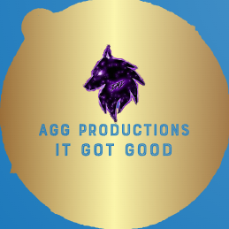

# AGG-Productions

  

Welcome to AGG Productions Launcher this launcher is a replacement for the old chaotic launcher which was old slow and just very plain. This launcher also now allows other people that are working on there own game to be able to upload it here and have some cool auto apdating and havee there game hosted for free (it supports any game made for windows Ex: Unity unreal and even native coded games, as long as the game can be started as an .exe)

# Building / Contributing

How to Add Features and to fix bugs in AGG-Productions

1. Fork the repo
2. Use Visual Studio 2019 with .netframework 4.7.2
3. Fix the bug or add the feature
4. Test to make sure if it works correctly

Other info
- (Only read if adding another feature) Remember that this launcher must be able to add games without changing the code each time.

# Old Launcher's Location

https://chaoticdev.weebly.com/

# Game Developer's Area

To add a game to AGG-Productions see the wiki page [Here](https://github.com/awesomegamergame/AGG-Productions/wiki/How-to-add-a-game)

To see how to use AGG-Productions features see the wiki page [Here](https://github.com/awesomegamergame/AGG-Productions/wiki/Features-and-how-to-use)
